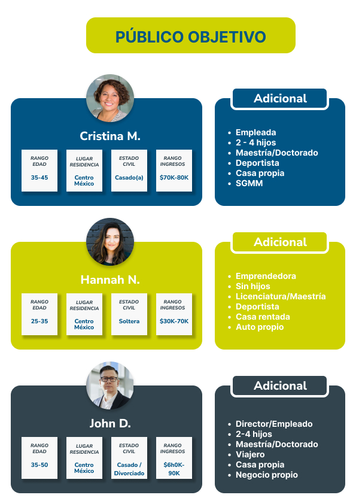

# Práctica 2 - Público objetivo *(Target Audience)*

Se determinan las características básicas de nuestro público objetivo, es decir, quienes serían nuestros cliente spotenciales y/o principales. Por supuesto, sin dejar de considerar a aquellos clientes que no se encuentren en este esquema de características pero que requieran de los servicios de la empresa.

