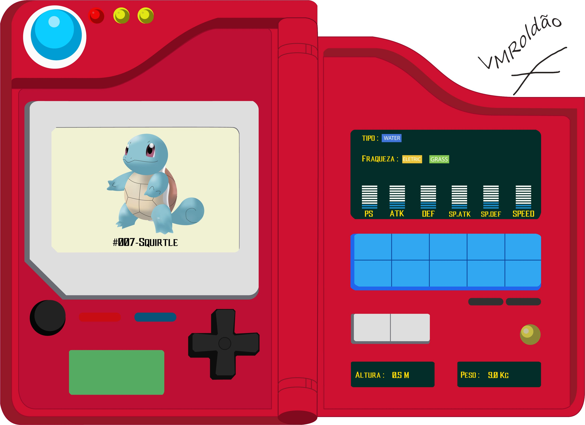

# PRÁCTICAS MÓDULO 04 JAVASCRIPT

## Prácticas correspondientes al módulo  4 **JavaScript** de la formación *"Misión Frontend"*

#### Los requerimientos para esta práctica son los siguientes:

* Maquetación del sitio con HTML
* Diseño con CSS para que parezca un pokedex la página, aquí les dejo una imágen de uno, pero pueden volar su creatividad a como gusten.

* Tener un input de entrada, donde se meta el nombre del pokemón a buscar.
* Tomar ese input e ir a consultar el API de pokeapi
* Mostrar en pantalla los siguientes datos del pokemón ingresado:
  * Nombre
  * Imágen
  * Tipo de pokemón
  * Estadísticas
  * Movimientos

**Bonus:**

* Bonus si tu página es responsive y se puede ver en celulares
* Bonus de despliegue de tu pokedex
* Bonus de uso de otras rutas como búsqueda por número de pokemón o mostrar un rango de pokemóns

### Contenido  

[Archivos con la práctica de maquetado HTML, estilos CSS y JavaScript](./mokepon/)

*La actualización de la práctica para completar los requerimientos bonus, en breve serán actualizados...*